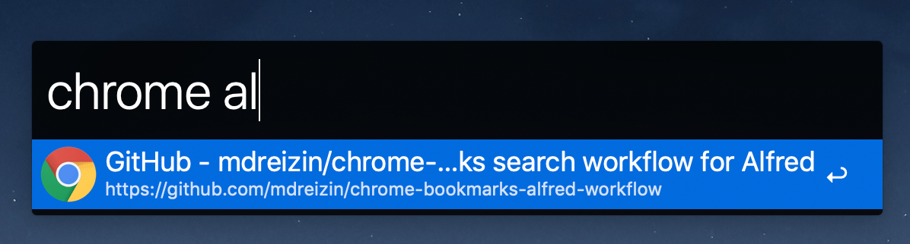

# chrome-bookmarks

> Chrome/Canary/Chromium bookmarks search workflow for Alfred

- [x] Google Chrome (`chrome`, `chrome-profiles`)
- [x] Google Chrome Canary (`canary`, `canary-profiles`)
- [x] Chromium (`chromium`, `chromium-profiles`)

## Commands

| Command | Description |
|:--|:--|
| `<browser>` | Searches bookmarks using `query`. If you would like to show bookmark folder please press Command (or Cmd) ⌘. |
| `<browser>-profile` | Sets active user profile. `Auto` options checks active user profile and uses it to search bookmarks. |

## Setup

- Run `brew install go`
- Run `make deps`

## Develop

- Run `make build`
- Install `./build/chrome-bookmarks.alfredworkflow`

## Test

- Run `make test`

## Cover

- Run `make cover` or `make cover-html`

## QA

### How to add missing `chromium`-based browser?

1. Add missing browser config to [`./configs/browser.yaml`](./configs/browser.yml) file.
2. Put missing browser icon in [`./assets`](./assets) directory.
3. Add missing workflow config to [`./configs/workflow.yml`](./configs/workflow.yml) file.
4. Run `make build` and install `./build/chrome-bookmarks.alfredworkflow` to test changes
5. Open PR
