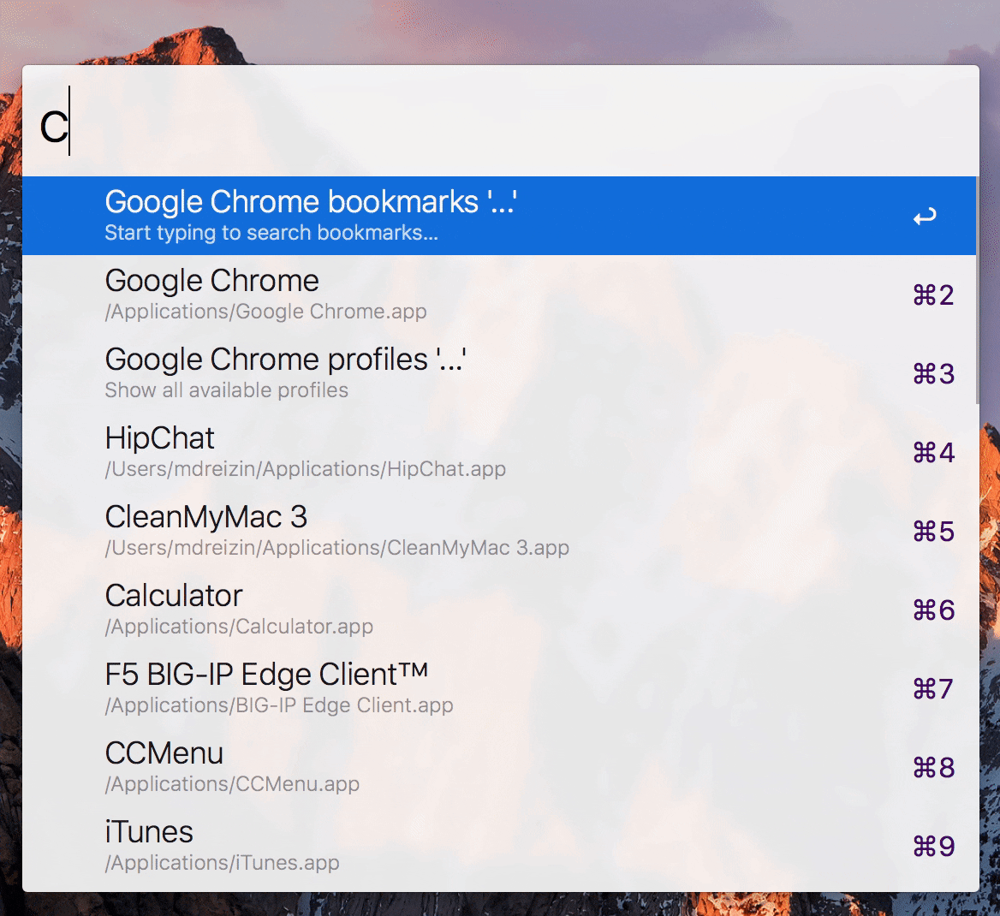

# chrome-bookmarks-alfred-workflow

> Chrome/Canary/Chromium bookmarks search workflow for Alfred

- [x] Google Chrome (`chrome`, `chrome-profiles`)
- [x] Google Chrome Canary (`canary`, `canary-profiles`)
- [x] Chromium (`chromium`, `chromium-profiles`)

## Download

All available releases you can find [here](https://github.com/mdreizin/chrome-bookmarks-alfred-workflow/releases).

## Options

`*-profiles`

`Auto` checks active browser profile and uses it to search bookmarks.

## Setup

- Run `brew install go glide`
- Run `make deps`

## Develop

- Run `make workflow`
- Open `./build` folder

## Test

- Run `make test`

## Cover

- Run `make cover` or `make cover-html`
